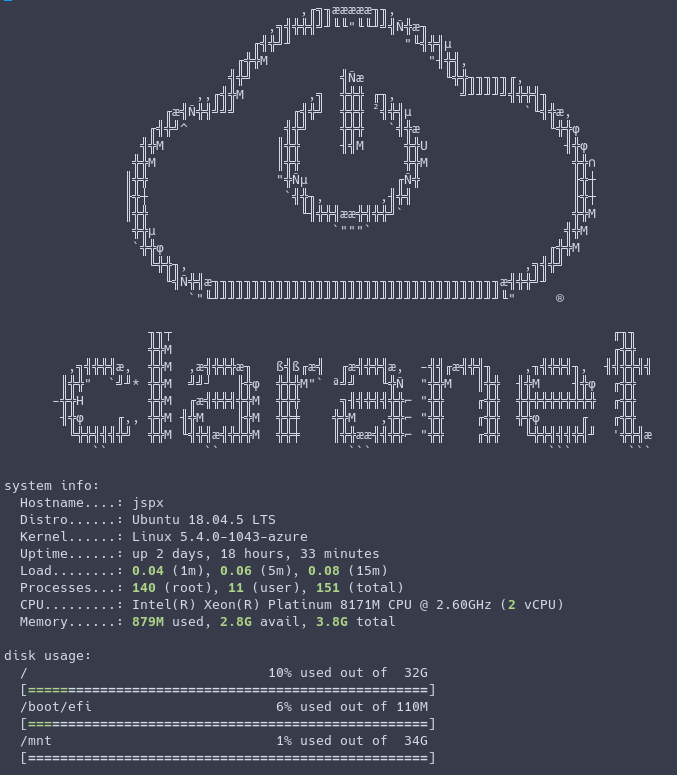

# Motd

Here is motd for Claranet.

## Preview



## Installation

### Banner only

Copy [motd](motd) file to `/etc/motd`:

```bash
curl -s https://raw.githubusercontent.com/claranet/motd/master/motd -o /etc/motd
```

### Dynamic with script

Run the [install.sh](install.sh) script as admin:

```bash
sudo ./install.sh
```

It is compatible with [update-motd](https://launchpad.net/update-motd) used by Ubuntu.

For not compatible distributions you will have to add the following line to `/etc/pam.d/sshd`:

```
session    optional   pam_exec.so          stdout /etc/update-motd.d/00-basic
```

You could also want to disable the "last login" information by configuring `PrintLastLog` to `no` in `/etc/ssh/sshd_config`.
